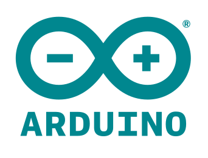

## Yo, hello!

 

> I'm Blackk, the owner of this profile. I'm glad you're here and hope you find something interesting. 
> If you don't, well it happens.  
> Have Fun!  
> 
> Oh! right right, you may want to know a bit about me. I think I can tell you some things   
> Let's see...

My actual name is Vitor, and I'm Brazilian. Brazil is a beautiful country, lot's good of food, places to travel to, all that good stuff. I know four idioms: Portuguese which's my first language, English, Spanish, and LIBRAS, which is the Brazilian sign language. All of them I've learnt by myself, but it took me a while, and I'm not the best, but it works out fine after all.

- 🔭 I’m currently working on:
  - [Findev](https://findev.com.br) 
    - A website that aims to smooth the search for developers, making a bridge between client and dev.
  - [OneFlower](https://github.com/Blackklegend/Oneflower) 
    - A Minecraft modpack.
  
- 🌱 I’m currently learning:  
  
  

- I'm skilled with hardware and operational systems, I caught myself troubleshooting for fun sometimes.

  
HTML

  
CSS

  
JavaScript

  
Bootstrap

  
PHP

  
C

  
C++

  
ARDUINO

  
MongoDB

  
PostgreSQL

  
MySQL

  
Python

  
Java

  
Spring Boot

  
Node.JS

  
React

  
TypeScript

  
Angular

  
React Native

  
Expo

- Other than the above I have some minor experience with:  

 

- 💬 Ask me about anything, if I know the answer, I'll tell you right away, if not, we'll find it.  

- ⚡ Fun fact: Our bodies actually can't feel temperature, just the electric charge moving around.
If it leaves your body then you feel cold, if it enters you feel warm.

